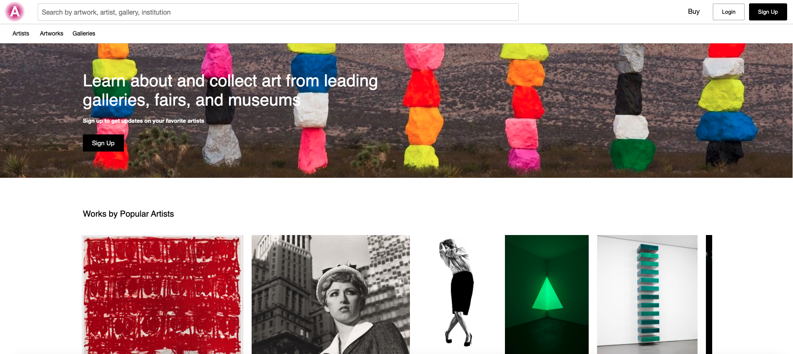
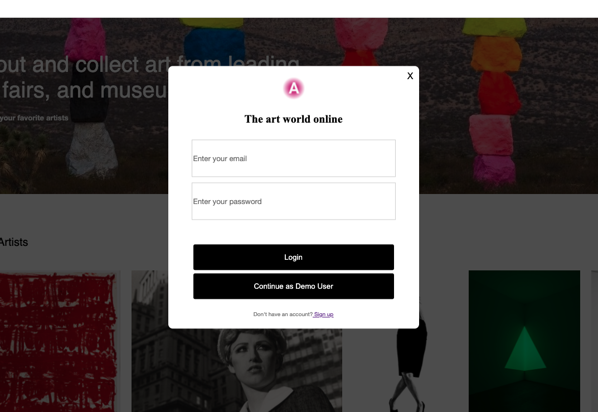
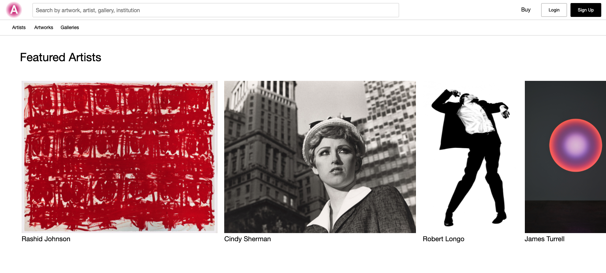
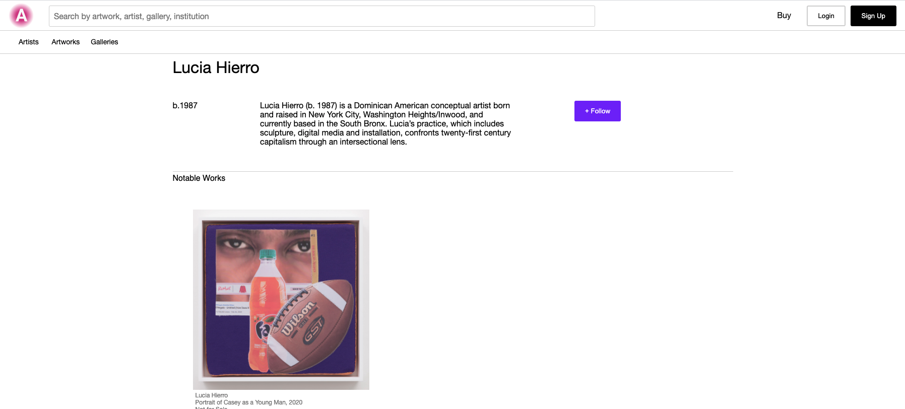
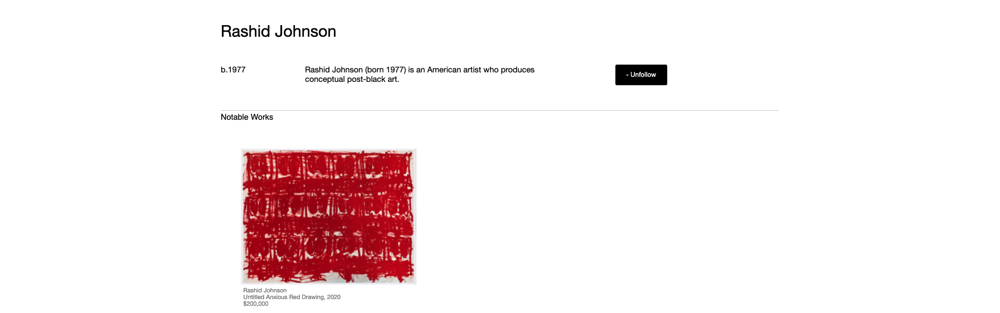

# README

## Artsee 

Artsee is an art platform that allows users to search, explore, inquire, purchase and learn about all things art.

Live Site: [Artsee](https://artsee-application.herokuapp.com/)





## Technologies Used
* Javascript 
* React
* Redux
* Ruby on Rails
* Postgres 
* AWS
* Heroku


## Functionality 
* Users can view featured artists and galleries on the splash page
  GIF OF SPLASH PAGE NAVIGATION

### Login / Signup 


### Artist Index 
* Displays all featured artists
* Associated galleries are displayed in the caption
* Incorporated side scroll styling

```
@artists.each do |artist|
    json.artists do 
        json.set! artist.id do
            json.partial! 'api/artists/artist', artist: artist 
        end 
    end

    json.gallery do 
        json.set! artist.gallery.id do 
            json.partial! 'api/galleries/gallery', gallery: artist.gallery
        end 
    end 
end
```


### Artist / Artwork Show

* Displays the selected information
* Users can follow the artist and navigate to their associated artworks and artists
* All artists' artworks are populated on each page




### Following Artists
* Logged in users can follow or unfollow artists
* My program checks if they currently follow them and changes the button accordingly

```
    let theBoolean = Object.values(state.entities.follows).some(follow => follow.followableId === artist.id && follow.followableType === 'Artist')
```
```
            {
              window.currentUser && this.props.theBoolean ?
              <button 
               className="follow-show-artist" 
               value="Unfollow" 
               onClick={() => this.props.unfollowArtist(this.props.artist.id)}>
               - Unfollow</button> :
              <button 
                className="follow-show-artist" 
                value="Follow" 
                onClick={() => this.props.followArtist(this.props.artist.id)}>
                + Follow</button> 
                }
```




